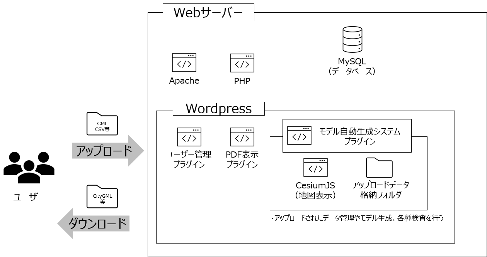

# モデル自動生成システム

## 概要

3D都市モデルの構築等に関する品質管理（主題属性正確度検証）、データ入出力、オープンデータ化を支援するための機能を提供するWordPressのプラグインです。

本ソフトウェアは、国土交通省の[Project PLATEAU](https://www.mlit.go.jp/plateau/)で開発され、3D都市モデルの品質管理支援に用いたWebポータルシステムです。対応データ形式は、内閣府地方創生推進事務局が定めた[i-都市再生技術仕様案 v2.0 (i-UR 2.0)](https://www.chisou.go.jp/tiiki/toshisaisei/itoshisaisei/iur/)に従い拡張された[OGC CityGML 2.0](https://www.ogc.org/standards/citygml)形式です。

## 動作環境、前提ソフトウェア

以下の環境で動作します。

* WordPress 5.7.1/5.6.1
* MySQL 5.7.29
* PHP 7.4.3

操作説明を閲覧する場合は、WordPressのプラグインPDF Embedder (4.6.1)が必要です。 
機能にログインする場合は、WordPressのプラグインSimple WordPress Membership (4.0.1)が必要です。 
CityGMLを3D Tilesに変換する場合は、citygml-to-3dtiles (19 Sep 2020)が必要です。 
地図機能を使用する場合は、CesiumJS (1.71)が必要です。 
サイトを見やすくするには、WordPressのテーマの入手やデザインの加工等が必要です。 

## システム全体図

## 利用方法

1. mapフォルダ、wp-contentフォルダをwordpressフォルダの直下にコピーします。
1. `\wp-content\plugins\usvpro-3d-city-management\inc\constants.php`内の実行ファイルの定義を実際の環境に合わせて変更して下さい。
1. ksk3d_backup.sql内の【KSK3D_BK_RPC_SITESTRING】の文字列をWordPressのURLに置換し、WordPressのデータベースにSQLとして実行します。
1. WordPressのプラグインメニューから本プラグインを有効にします。

## 操作マニュアル

|名称|ファイル|
| - | - |
|ログインについて|[User-Guide_User-login.pdf](/wp-content/uploads/2020/12/User-Guide_User-login.pdf)|
|データセットの操作について|[User-Guide_Data-set-Operation.pdf](/wp-content/uploads/2020/12/User-Guide_Data-set-Operation.pdf)|
|品質管理（プロジェクト管理～論理検査）|[User-Guide_Data-quality-Management_01.pdf](/wp-content/uploads/2020/12/User-Guide_Data-quality-Management_01.pdf)|
|品質管理（目視検査）|[User-Guide_Data-quality-Management_02.pdf](/wp-content/uploads/2020/12/User-Guide_Data-quality-Management_02.pdf)|
|バックグラウンド処理の確認|[User-Guide_Check-Background-Processing.pdf](/wp-content/uploads/2020/11/User-Guide_Check-Background-Processing.pdf)|
|マップの操作について|[User-Guide_Map-Operation.pdf](/wp-content/uploads/2020/11/User-Guide_Map-Operation.pdf)|

## ライセンス

Copyright (C) 2021 Hitachi, Ltd.

本ソフトウェアではWordPressを利用させて頂いております。WordPress本体のライセンスに従い、本ソフトウェアも[GNU General Public License v2.0](https://github.com/Project-PLATEAU/CityGML-production-system/blob/main/LICENSE)を適用します。

    WordPress - Web publishing software

    Copyright 2011-2022 by the contributors

    This program is free software; you can redistribute it and/or modify
    it under the terms of the GNU General Public License as published by
    the Free Software Foundation; either version 2 of the License, or
    (at your option) any later version.

    This program is distributed in the hope that it will be useful,
    but WITHOUT ANY WARRANTY; without even the implied warranty of
    MERCHANTABILITY or FITNESS FOR A PARTICULAR PURPOSE.  See the
    GNU General Public License for more details.

    You should have received a copy of the GNU General Public License
    along with this program; if not, write to the Free Software
    Foundation, Inc., 51 Franklin St, Fifth Floor, Boston, MA  02110-1301  USA

## 注意事項
* 本プラグインは実験的に提供しているものです。動作保証は行っておりません。
* 予告なく変更・削除する可能性があります。
* 本プラグインの利用により生じた損失及び損害等について、国土交通省及び著作権者はいかなる責任も負わないものとします。

## 参考資料

* 品質評価システム: https://github.com/Project-PLATEAU/CityGML-evaluation-system
* 位相一貫性検証機能: https://github.com/Project-PLATEAU/CityGML-geometry-validator
* 書式・概念一貫性検証機能: https://github.com/Project-PLATEAU/CityGML-validation-function

